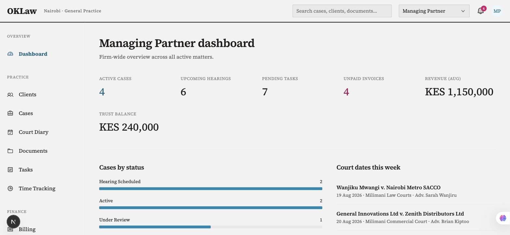
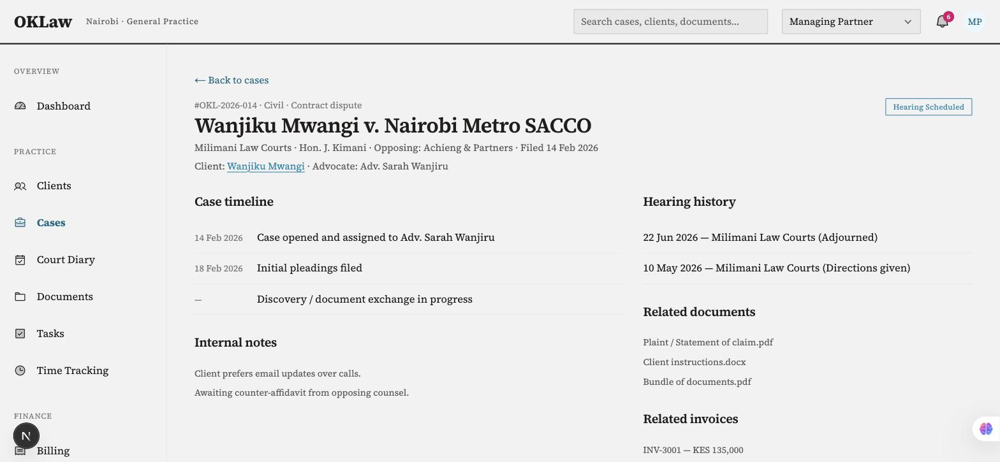
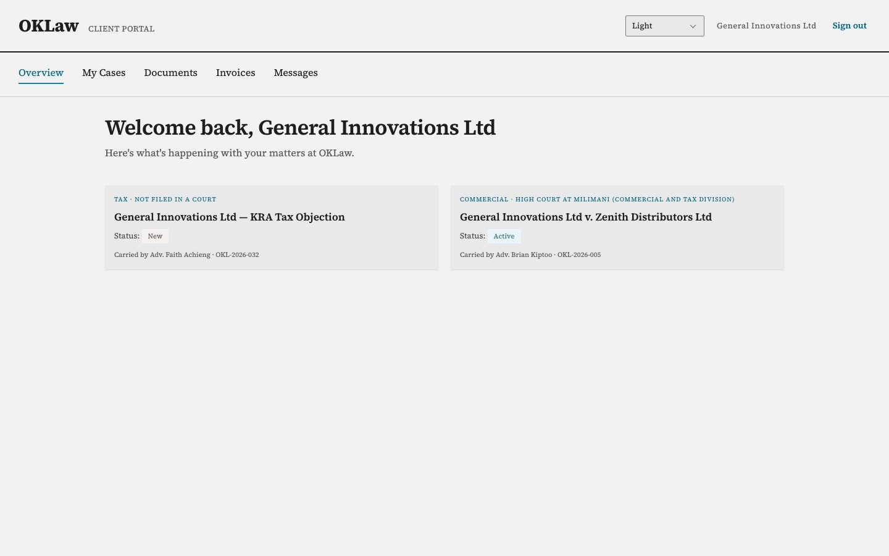
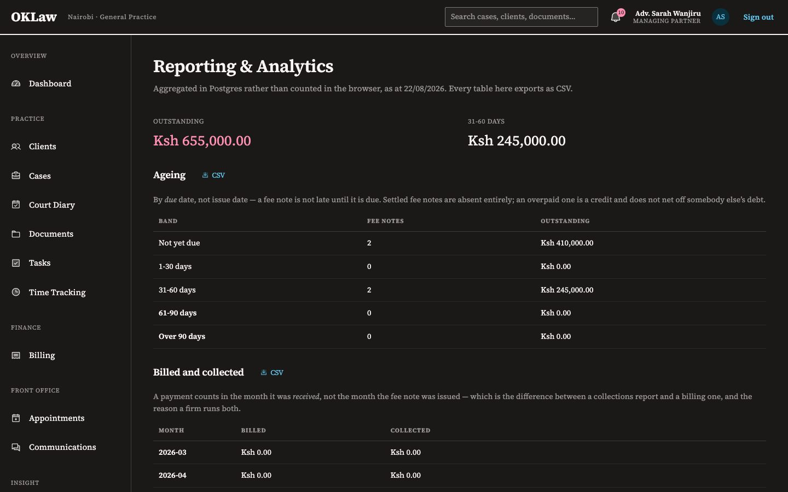

# OKLaw

**A practice management system for a Kenyan law firm** — matters, court diary,
trust accounting, billing, documents, and a client portal.

Built as a study in production TypeScript: [Effect](https://effect.website) end
to end, a domain modelled from actual Kenyan statute rather than a generic CRUD
schema, and an architecture whose layering is enforced by the linter rather than
by good intentions.

**[▸ Live demo](https://law-firmmanagementsystem.vercel.app/sign-in)** — one
click signs you in as a managing partner, an advocate, a legal assistant, a
finance officer, a receptionist, or a client. Read down the list: each role can
do strictly less than the one above it, and that is the point.

[](https://github.com/youneedgreg/law-firm_management_system/actions/workflows/ci.yml)


1,147 unit tests · 49 integration tests against real Postgres · 29 end-to-end
specs in a browser · 14 [architecture decision records](docs/adr/)

> **Source-available, not open source.** © 2026 Gregory Temwa Odete, all rights
> reserved. Read it, evaluate it, learn from it — but commercial use, deployment
> and derivative works need written permission. See [LICENSE.md](LICENSE.md);
> commercial licences are available.

---



---

## The problem

Small and mid-sized firms in Nairobi run on a patchwork of spreadsheets,
WhatsApp, and paper diaries. The consequences are specific and expensive:

- **A missed court date** is not an inconvenience; it can mean a matter
  dismissed for want of prosecution.
- **Client money held in trust** is governed by the Advocates (Accounts) Rules.
  Commingling it with firm money is a disciplinary matter, not a bookkeeping
  error.
- **Conflicts of interest** must be checked before a matter is opened, against
  every client the firm has ever acted for or against.

These are rules with hard edges, which makes them a good fit for a type system.
Most of the interesting work in this repository is about encoding them so that
violating one fails to compile, or fails loudly at a boundary, rather than
producing a quietly wrong number.

The longest single piece of that work is written up as a case study:
[**one rule about client money, in four places**](docs/case-study-trust-accounting.md)
— why Rule 10 needs a domain function, a database trigger, a repository
translation and a transaction ordering, and what breaks if you remove any of
them.

## Screens

| Case detail                                 | Billing and trust                   |
| ------------------------------------------- | ----------------------------------- |
|  |  |

The client portal is a separate surface with a strict visibility rule — a portal
user may only ever see their own matters, and every other client's records
answer _not found_ rather than _forbidden_:



Both themes are declared once per token with `light-dark()`, so there is no
second palette to drift:



These are regenerated by `npm run docs:screens`, because they went stale twice
before that existed.

## Architecture

Dependencies point inward. The domain knows nothing about how it is stored or
served, which is what makes it testable without any infrastructure at all.

```
src/
  domain/      Pure. Schemas, branded IDs, tagged errors, business rules.
               No I/O, no framework, no imports from anywhere else in src/.
  services/    Effect services and Layers. Depends on repository interfaces
               it declares itself, never on a concrete implementation.
  infra/       The dirty edges: Postgres repositories, blob storage, telemetry,
               migrations, the seed, and provisioning a firm's first login.
  api/         HttpApi definition — one contract, server and client derived.
  runtime/     ManagedRuntime wiring the Layers together, one per process.
  rx/          The same idea in the browser: atoms built on the generated client.
  app/         Next.js App Router. Thin; calls into services.
  components/  React components.
  lib/         Formatting, nav config, the demo roster, the firm's identity.
```

This is enforced, not documented. `eslint.boundaries.mjs` declares the
boundaries and `eslint.config.mjs` turns them into `no-restricted-imports`
rules, so a service reaching into `infra/` fails CI:

```js
{
  name: "domain",
  files: ["src/domain/**/*.ts"],
  forbidden: ["@/services/*", "@/infra/*", "@/api/*", "@/app/*", ...],
  because: "domain/ must stay pure: no I/O, no framework, no knowledge of
            how it is stored or served.",
}
```

An architecture that lives only in a README erodes by month three. So does a
diagram: **[`docs/architecture.md`](docs/architecture.md)** draws the system
context, the layers and the lifecycle of one request, and a test reads the
linter's own boundary table and fails if the diagram claims a dependency the
linter forbids.

The database has the same treatment —
**[`docs/erd.md`](docs/erd.md)** is generated from the migrations by applying
them to a real Postgres, and a test regenerates it and compares.

## Why Effect

Three properties matter more here than development speed, and plain
`async`/`await` provides none of them:

**Errors are values, in the type signature.** A missed error path in a trust
account withdrawal is not a crash — it is a misappropriation. Every fallible
operation enumerates what it can fail with, and an unhandled case is a compile
error rather than a runtime surprise.

**Dependencies are injected as Layers.** Business rules are tested by supplying
a different implementation, not by patching modules. There is no mocking
framework in this repository and there will not be one.

**Time is virtual in tests.** Statutory deadline computation, retry policies,
and timeouts are worthless if the only way to test them is to wait. Effect's
`TestClock` makes them instant and deterministic — the harness test verifies a
one-hour sleep in 33 milliseconds:

```ts
it.effect("collapses a one-hour sleep to nothing under TestClock", () =>
  Effect.gen(function* () {
    const fiber = yield* Effect.fork(
      Effect.sleep(Duration.hours(1)).pipe(Effect.as("woke up")),
    );

    yield* TestClock.adjust(Duration.hours(1));

    expect(yield* Fiber.join(fiber)).toBe("woke up");
  }),
);
```

The full reasoning, including the costs, is in
[ADR 0002](docs/adr/0002-effect-as-the-application-runtime.md).

## The domain

The seed data is Kenyan and the model commits to it. A court is not a string:

```ts
export const Court = Schema.Union(
  SupremeCourt,
  CourtOfAppeal,
  HighCourt, // + division
  MagistratesCourt, // + rank, and the pecuniary limit that follows from it
  EmploymentAndLabourRelationsCourt,
  EnvironmentAndLandCourt,
);
```

`canHear` returns the **statutory reason** on a refusal rather than a boolean,
and honours the s. 7(3) customary-law exemption. A magistrates' court refuses a
9,000,000 claim and says why.

Money is integer minor units, never floating point, and `allocate` is proven
never to lose a cent across 1,400 splits. Case status is a state machine whose
transition table is the only list of legal moves — the buttons on the screen are
built from it, so there is no second list to fall out of step. Limitation
periods come from the verified s. 4 figures and carry their provision, and the
month arithmetic clamps rather than overflowing, so 29 February plus three years
lands on 28 February.

Every statutory claim is cited in [`docs/domain-notes.md`](docs/domain-notes.md),
marked ✅ where it was verified against the primary text and ⚠️ where the source
is secondary and unconfirmed.

## Stack

| Layer        | Choice                                          | Why                                                                                        |
| ------------ | ----------------------------------------------- | ------------------------------------------------------------------------------------------ |
| Framework    | Next.js 16, React 19                            | App Router, Server Components, Server Actions                                              |
| Runtime      | Effect 3.22                                     | Typed errors, Layers, virtual time                                                         |
| Validation   | `effect/Schema`                                 | One schema for parsing, types, DB mapping and form constraints                             |
| Database     | Neon Postgres + `@effect/sql-pg`                | Relational domain; invariants as constraints, including one trigger                        |
| Auth         | Better Auth, self-hosted                        | Sessions as rows we own and can join against                                               |
| Files        | Vercel Blob, private                            | Legal documents are confidential by default                                                |
| Client state | `@effect-rx/rx-react`                           | An atom runs an `Effect`, so a refusal arrives as the class the service failed with        |
| Styling      | Hand-written CSS                                | A deliberate choice — see [ADR 0007](docs/adr/0007-keep-the-hand-written-design-system.md) |
| Telemetry    | `@effect/opentelemetry` + `@vercel/otel`        | Effect's spans nest inside Next's; no vendor is compiled in                                |
| Testing      | Vitest + `@effect/vitest` + Playwright + PGlite | Hermetic, deterministic, no shared state                                                   |

Two version notes that trip people up: `Schema` is imported from `effect` core —
the standalone `@effect/schema` package is deprecated and merged in. And
Next.js 16 renamed Middleware to Proxy (`proxy.ts`), which is for optimistic
redirects only; the real authorization is in the data layer, checked on every
read.

## Running it

Requires Node 24+ and npm. No Docker: the schema tests run Postgres in
WebAssembly.

```bash
npm install
npm run dev          # http://localhost:3000
npm run db:migrate   # against the DATABASE_URL in .env.local
npm run db:seed      # the demonstration firm, decoded through the domain schemas
```

`db:seed` needs `DEMO_DEPLOYMENT=true` in `.env.local`. It wipes every table it
owns before loading, so it refuses to run anywhere that has not said it is a
demonstration — see [running it for a firm](#running-it-for-a-firm).

`.env.local` is not committed. On a machine linked to the deployment,
`vercel env pull` writes it; otherwise the required variables are listed under
[configuration](#configuration).

| Command                    | What it does                                          |
| -------------------------- | ----------------------------------------------------- |
| `npm test`                 | Unit, service and schema tests — no database required |
| `npm run test:coverage`    | The same, with the thresholds the badge claims        |
| `npm run test:integration` | Against a real Postgres (`DATABASE_URL` required)     |
| `npm run test:e2e`         | Playwright, against a production build and real data  |
| `npm run typecheck`        | `next typegen && tsc --noEmit`                        |
| `npm run lint`             | ESLint, including the architecture boundaries         |
| `npm run verify`           | Everything CI runs                                    |
| `npm run verify:clean`     | The same, from a wiped `node_modules` and `.next`     |
| `npm run docs:erd`         | Regenerates `docs/erd.md` from the migrations         |
| `npm run docs:screens`     | Retakes the screenshots above                         |
| `npm run docs:coverage`    | Measures coverage and redraws the badge above         |
| `npm run db:migrate`       | Applies pending migrations to `DATABASE_URL`          |
| `npm run db:seed`          | Loads the demonstration firm. Refuses elsewhere       |
| `npm run provision:admin`  | Creates a login on an installation. See below         |
| `npm run perf`             | Signs in and runs Lighthouse over five screens        |

Typechecking runs `next typegen` first because `PageProps` and `LayoutProps` are
globals Next generates into `.next/types/`. Without it, `tsc` passes on a machine
that has built recently and fails on a fresh checkout — which is what
`verify:clean` exists to catch before pushing.

### Configuration

Three variables are required — `DATABASE_URL`, `BETTER_AUTH_SECRET` and
`BLOB_READ_WRITE_TOKEN` — and every one is read once, at startup, through a
validated schema in `src/infra/config.ts`. A malformed connection string fails
immediately and says what is wrong, rather than failing at the first query with
a message about `undefined`.

| Variable                      | Default                                | What it changes                                          |
| ----------------------------- | -------------------------------------- | -------------------------------------------------------- |
| `LOG_LEVEL`                   | `Info`                                 | Anything Effect's `LogLevel` accepts. A typo is refused  |
| `LOG_FORMAT`                  | `json` when deployed, `pretty` locally | A drain parses one and cannot filter the other           |
| `OTEL_EXPORTER_OTLP_ENDPOINT` | unset                                  | Where traces go. Unset, spans are created and dropped    |
| `OTEL_EXPORTER_OTLP_HEADERS`  | unset                                  | The backend's auth header, if it wants one               |
| `DATABASE_MAX_CONNECTIONS`    | `5`                                    | Neon pools at the proxy, so a small local pool is plenty |
| `CRON_SECRET`                 | unset                                  | The nightly demo reset. Unset, the endpoint answers 503  |
| `DEMO_DEPLOYMENT`             | `false`                                | Whether this is the demonstration. See below             |
| `FIRM_NAME`                   | `OKLaw Advocates`                      | The firm this installation serves, in full               |
| `FIRM_SHORT_NAME`             | `OKLaw`                                | The masthead wordmark. Around a dozen characters         |
| `FIRM_TAGLINE`                | `Nairobi · General Practice`           | The line beside the wordmark                             |

`GET /api/health` reports whether the database answered, how long it took, and
which commit is serving. It is unauthenticated and says nothing about _why_ a
dependency failed; that goes to the log.

### Running it for a firm

The demonstration and an installation are the same build. What separates them is
`DEMO_DEPLOYMENT`, and the interesting part is its default.

A public demo needs things a real system must not have: a one-click switcher
that mints a session for any of six roles without a password, a shared password
printed on the sign-in page, and a cron that empties every table at midnight so
that the next visitor finds the firm as the last one did. Each of those is a
breach on a system holding real matters.

So each is conditional, and the flag **defaults to off**. An unset variable, a
misspelt one, and a deployment created by somebody who has never read this file
all mean the same thing: a real installation, with the demonstration
affordances absent. Absence cannot mean "demo", because the two mistakes are not
comparable — a demonstration that quietly becomes an ordinary application is a
dull afternoon, and the reverse publishes a one-click administrator login.

|                       | Demonstration | Installation |
| --------------------- | ------------- | ------------ |
| `DEMO_DEPLOYMENT`     | `true`        | unset        |
| `CRON_SECRET`         | set           | unset        |
| One-click sign-in     | on            | refused      |
| `GET /api/cron/reset` | resets        | `404`        |
| `npm run db:seed`     | loads         | refused      |
| `FIRM_*`              | defaults      | the firm's   |

The reset is guarded twice — the secret **and** the flag, required together
rather than either alone — because `vercel.json` is committed, so a second
project built from this repository registers the same nightly cron whether
anybody meant it to or not. One variable is too much weight for that.

Sign-up is closed permanently (`disableSignUp`), which is right for a system
where a login belongs to a member of staff or to a client the firm has already
taken on. It also means a freshly migrated database has nobody who can sign in,
so the first account is made from a terminal:

```bash
npm run db:migrate                      # no seed: it refuses outside the demo
npm run provision:admin -- --name "Grace Kimani" \
  --email grace@example.co.ke \
  --role "Managing Partner" \
  --certificate P.105/2026 --certificate-year 2026
```

It makes two reads and three writes — the staff record, the login, and the
credential Better Auth checks — and touches nothing else. It refuses a password
shorter than the application's own floor, an address that already has a login,
and an address already on the staff list, all three before the first write, so a
refused run leaves nothing behind. The password is asked for on the terminal and
never echoed; `ADMIN_PASSWORD` exists for a session with no terminal and is
documented as the second choice, because an environment variable is visible to
`ps` and lands in shell history.

The reasoning behind all of this, including what a second installation would
cost and when row-level tenancy would be worth it, is in
[`docs/first-client.md`](docs/first-client.md).

This repository is trunk-based: all work lands on `main`, with no feature
branches or pull requests. Two hooks stand in for the review gate — pre-commit
runs Prettier and ESLint on staged files, and pre-push runs the lockfile check,
formatting, typecheck, lint, and tests. CI then runs the full suite, including
the build and the coverage thresholds, on every push to `main`, which also
deploys.

An installation is the one exception, and it is a deployment pointer rather than
a return to feature branches. `main` deploys the demonstration; a `release`
branch deploys installations, and changes reach it by merge from `main` after
they have been seen working on the demo. The reason is not review — D-9 already
settles that self-review is the cost of working alone — it is that the thing on
the other end belongs to somebody else, and an experiment pushed at eleven at
night should not be able to reach a firm's live matters by being pushed at all.

Nothing about a firm's installation appears in this repository: no name, no
domain, no screenshots. The demonstration is fictional and stays that way.

## What this was for, and what I learned

Seven things I would not have learned from a tutorial, in the order they cost me
the most time.

**A rule enforced in one place is not enforced.** Rule 10 lives in the domain,
in a trigger, in a repository translation and in the ordering of two writes
inside one transaction — and each placement answers a different question.
Removing any of them leaves a system that is correct in testing and wrong on a
busy afternoon.

**The failure modes that cost the most are the silent ones.** An undefined CSS
custom property is not an error; it invalidates one declaration and the browser
moves on. Two chart bars were drawing in nothing on a page whose figures had
already been verified in a browser. A class name that does not exist is not an
error either, so the sign-in refusal rendered as ordinary body text. Both were
found by parsing the stylesheet in a test, and neither was visible any other
way.

**Measure before optimising, and then check what you measured.** The Lighthouse
rig said the app was slow; the app was fine and the machine running the rig was
220ms from the database. The health probe's two-second budget would have
reported `degraded` for a deployment that goes on to serve the page, because a
cold Neon answers in 1,657ms.

**"Retry on transient errors" is one step from posting the payment twice.** The
question is not whether an error looks transient — it is what the previous
attempt _did_. Never ran, rolled back, or nobody knows; the third is safe for
reads and not for writes.

**A safeguard can be the attack.** Locking an account after five failed
sign-ins hands anybody who can read the firm's website a way to lock a partner
out on the morning of a hearing. Every counter here includes the source, and the
one thing that would actually raise the floor — a second factor — is named as
absent rather than left as an implication.

**The default is the control, not the flag.** Making the demonstration's
affordances conditional was an afternoon; deciding which way the condition
should fail took longer and mattered more. `DEMO_DEPLOYMENT` defaults to `false`
so that an unset variable, a misspelt one, and a project created by somebody who
has never read this file all mean _a real installation with the affordances
off_. Get that backwards and the flag is worse than no flag. The same argument
runs through the reset being guarded twice: a second control consulted
_instead_ of the first is a second door, and one required _alongside_ it is a
second lock.

**Documents rot in a way code does not.** Nothing breaks when a diagram becomes
wrong, so the ones that state facts are generated from the code or checked
against it by a test ([ADR 0014](docs/adr/0014-documentation-that-fails-the-build.md)).
This README is the exception, and it is the document that had already drifted
two phases behind the code when Phase 10 rewrote it. It still drifts: writing
this revision turned up a table claiming the reset endpoint was a `POST` and a
sentence with its own reads and writes the wrong way round.

## Honest status

**Working today:** every route reads Postgres. Twenty modules — matters,
clients, billing, trust, time, the court diary, documents, tasks,
correspondence, the client portal, reports, search, appointments and the
dashboard — go through a service, a repository and a migration. Identity is
real: sessions in Postgres, a `CurrentUser` that every service _requires in its
type_ so an unauthorized read does not compile, permissions as data, and an
audit trail written inside each mutation's own transaction into a table
Postgres refuses to let anybody update. There is a typed `HttpApi` contract from
which the router, the generated client and the OpenAPI document are all derived.
It can be diagnosed: one trace per request, every log line carrying the trace
id, retries classified by what the previous attempt did, a time budget on every
call that leaves the process, and a durable throttle in front of sign-in. It is
usable from a keyboard, on a phone, and in the dark, at WCAG 2.2 AA with the
contrast measured from the stylesheet rather than sampled from a screenshot.

**Not built:** the Testcontainers job in CI is still stubbed off pending Docker
(Phase 12), and so is the end-to-end job — those specs write to the demo
database, and pointing them at it from an unattended push would put a run's
debris in front of whoever opened the demo. Headless primitives for the dialog
and date picker are still hand-rolled. An Effect 4 migration is deliberately
deferred until `@effect-rx` ships a v4 track (Phase 11).

**Configuration rather than code:** traces export only where
`OTEL_EXPORTER_OTLP_ENDPOINT` is set. Nothing in the application names a
vendor, and no backend is claimed here as verified.

**Deliberately out of scope:** multi-tenancy. One firm, six staff roles and a
client portal. Adding
`firm_id` to every table and every query would be plumbing rather than signal;
the reasoning is in [ADR 0003](docs/adr/0003-single-firm-scope.md).

That decision is what makes the separation above a deployment boundary rather
than a row-level one. A second firm is a second deployment with a second
database, not a column — which costs an installation to stand up and, in
exchange, means no query in this system can return one firm's matters to
another by omitting a predicate. Where row-level tenancy would start to be worth
its price is written down in [`docs/first-client.md`](docs/first-client.md)
rather than left as an implication.

**Stood up, and not:** the demonstration is live and is the link at the top of
this page. No firm's installation has been deployed from this repository yet;
the code that separates the two is written and tested, and the checks that can
only be run against a real second deployment are listed, unticked, in the same
document.

## Documentation

- [`docs/architecture.md`](docs/architecture.md) — system context, layers, and
  the lifecycle of one request
- [`docs/erd.md`](docs/erd.md) — the database, generated from the migrations
- [`docs/case-study-trust-accounting.md`](docs/case-study-trust-accounting.md) —
  the hardest problem here, at length
- [`docs/adr/`](docs/adr/) — fourteen decision records, readable
  [as a narrative](docs/adr/README.md), each naming what was rejected
- [`docs/domain-notes.md`](docs/domain-notes.md) — the statutory research, with
  citations and confidence markers
- [`docs/design-system.md`](docs/design-system.md) — tokens, contrast
  obligations, and the exemptions
- [`docs/first-client.md`](docs/first-client.md) — how one build serves a public
  demonstration and a firm's installation, and what row-level tenancy would cost
- [`docs/engagement-terms.md`](docs/engagement-terms.md) — the commercial half:
  ownership, data protection, support and exit, in plain English
- [`ROADMAP.md`](ROADMAP.md) — the plan, phase by phase, with the decision log
- [`LICENSE.md`](LICENSE.md) — what reading this does and does not permit

## Licence

**© 2026 Gregory Temwa Odete. All rights reserved.** This is source-available,
not open source — the full terms are in [LICENSE.md](LICENSE.md).

The short version:

|                                                |                    |
| ---------------------------------------------- | ------------------ |
| Read the source, evaluate it, learn from it    | Yes, and welcome   |
| Quote excerpts with attribution                | Yes                |
| Run it locally to see it work while evaluating | Yes                |
| Deploy it, for yourself or anyone else         | Written permission |
| Use it commercially, modified or not           | Written permission |
| Copy substantial parts into your own work      | Written permission |

The restrictions exist so that commercial conversations happen rather than to
prevent them — **commercial licences are available**, including for firms
wanting to run this as their practice management system.

This repository is public because the reasoning in it is the point. None of
that is a grant of use.

---

Built by [Gregory Temwa Odete](https://github.com/youneedgreg).
