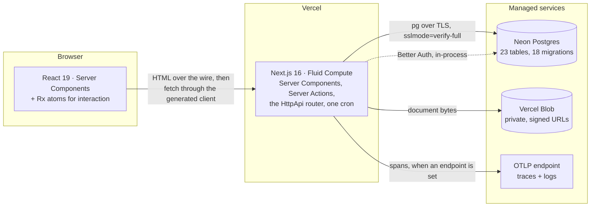
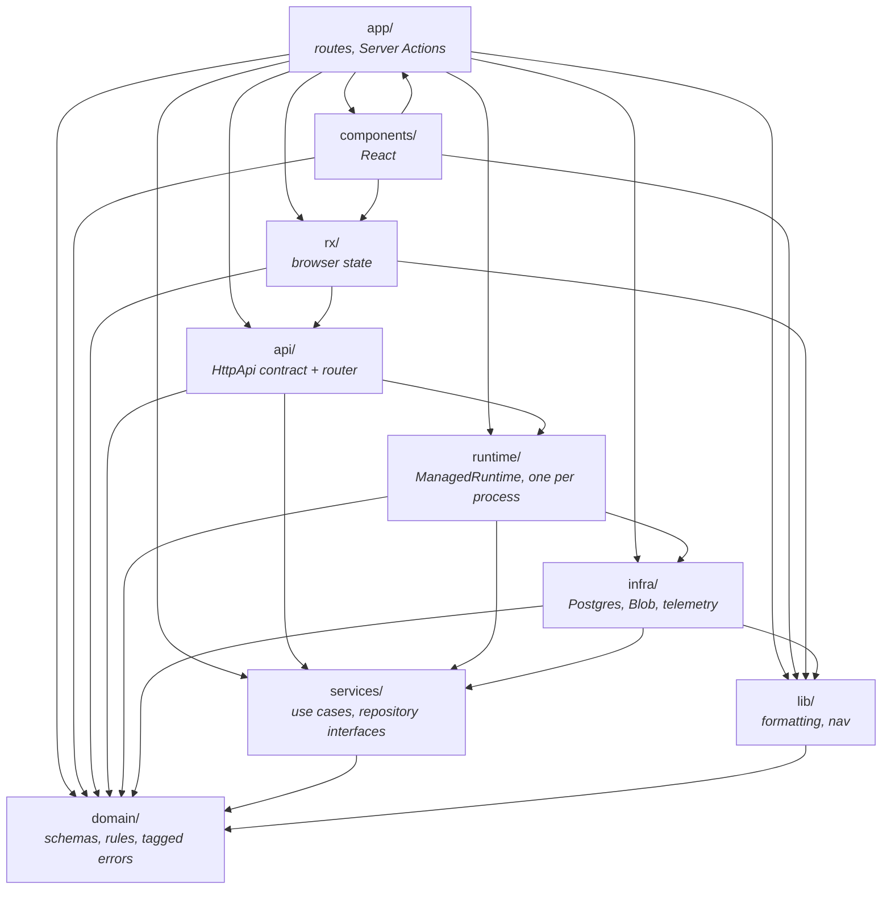
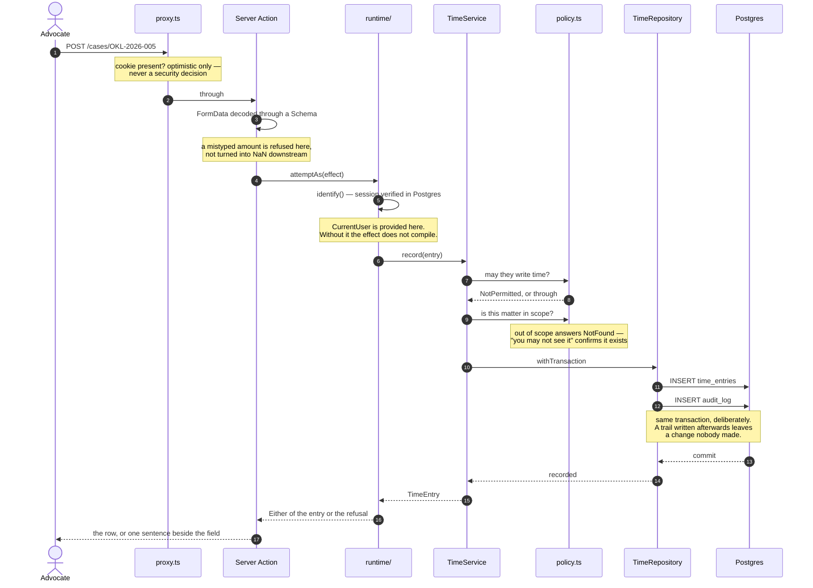

# Architecture

Three views, at three altitudes: what this system talks to, how the code inside
it is layered, and what actually happens when somebody presses a button.

The second one is the load-bearing diagram. Every arrow on it is checked —
`src/architecture.test.ts` reads the boundary table the linter is configured
from and fails if this page draws a dependency the linter forbids, or omits a
directory the linter governs. A diagram that has drifted from the code is worse
than no diagram, because it is believed.

---

## 1. System context

What runs where, and what leaves the process.

**There is no separate API server.** The `HttpApi` contract is served by a Next
route handler in the same process that renders the pages, so a Server Component
calls the service directly and the browser calls it over HTTP — one
implementation, two callers. See [ADR 0002](adr/0002-effect-as-the-application-runtime.md).

**Better Auth is a library, not a service.** Sessions are rows in the same
Postgres, reached over the same pool, which is what lets an authorization check
be a join rather than a network call ([ADR 0004](adr/0004-self-hosted-authentication.md)).

**Nothing names a telemetry vendor.** `@vercel/otel` reads the endpoint from the
environment, so pointing this at another backend is two variables and no
deployment ([ADR 0011](adr/0011-observability-and-resilience.md)).

---

## 2. Layers

Dependencies point inward. `domain/` imports nothing; everything else may only
reach the layers below it.

**The rule that makes this real is mechanical.** `eslint.boundaries.mjs`
declares what each directory may not import and `eslint.config.mjs` turns that
into `no-restricted-imports`, so a service reaching into `infra/` fails CI
rather than surviving review. The patterns are written four ways per layer,
because the rule matches the import _string_: blocking `@/infra/*` alone leaves
`../../infra/sql/client` wide open, and a probe walked straight through exactly
that hole in Phase 4.

**`domain/` has no outgoing arrow, and that is the whole design.** It cannot
import `lib/`, so it cannot reach a formatter; it cannot import `services/`, so
it cannot perform I/O. What is left is a layer that runs in a test with no
setup at all — no database, no container, no mocking framework — which is why
the business rules are the best-tested part of this repository.

**Two arrows are worth arguing with, so they are named here rather than
smoothed over.**

`components/ → app/` runs outward. `Topbar` and `PortalShell` import the
`signOut` Server Action, and a Server Action has to be defined in a `"use
server"` module — which belongs to the sign-in route, because that is where the
audit entry for signing out is written. The alternative is a second sign-out
path with no trail, and one backwards import is the cheaper of those.

`app/ → infra/` is real and narrow: `/api/health` reaches `ServiceIdentity` for
the commit it is serving, and the cron route reaches the seed. Neither goes
near a repository — those are _provided_ to the services and never exposed,
which is what stops a page reading `CaseRepository` and skipping the
authorization in front of it.

---

## 3. The lifecycle of one request

Recording two hours against a matter — a mutation, so it exercises everything:
the session, the permission, the scope, the rule, the transaction, and the
trail.

**Every refusal in that diagram is a value, not an exception.** `NotPermitted`,
`NotFound`, `CaseAlreadyBilled` and the rest are tagged errors in the effect's
type, so a caller that forgets one does not compile. Only the genuinely
unexpected — a database that will not answer — leaves the `Either` and reaches
`error.tsx`, and it is reported at `onRequestError` with the route and the
digest on the line.

**The two checks in the middle are separate on purpose.** A portal user
genuinely holds `case:read`; what protects the other five clients is the _scope_
check, not the permission one. Conflating them yields either a portal that can
read nothing or a permission check that passes over an unscoped query
([ADR 0010](adr/0010-authorization-as-a-typed-policy-layer.md)).

**The trace covers the whole diagram, not half of it.** Effect's tracer is built
from the globally registered provider, so the service and repository spans nest
_inside_ Next's request span rather than forming a second, parallel trace. Every
log line inside the request carries that trace id, because the logger reads the
current span out of the fiber instead of being handed one.

---

## Where to read next

| Question                                | File                                                               |
| --------------------------------------- | ------------------------------------------------------------------ |
| What is stored, and what points at what | [`erd.md`](erd.md) — generated from the migrations                 |
| Why Effect, and what it costs           | [ADR 0002](adr/0002-effect-as-the-application-runtime.md)          |
| Why the domain is Kenyan-specific       | [`domain-notes.md`](domain-notes.md), with citations               |
| How the design system is enforced       | [`design-system.md`](design-system.md)                             |
| The hardest problem here                | [`case-study-trust-accounting.md`](case-study-trust-accounting.md) |
