# The database, as it actually is

<!-- Generated by `npm run docs:erd`. Do not edit by hand:
     `src/infra/sql/erd.test.ts` fails when this file and the migrations
     disagree, and it compares the whole page. -->

23 tables and 34 foreign keys, read out of `information_schema` after every migration has been
applied to a real Postgres — PGlite, in-process, the same way
`schema.test.ts` checks the constraints. Nothing here is drawn from memory.

**What is not on it.** Every `CHECK`, both triggers, and every partial
index. This page answers *what is stored and what points at what*; the
interesting half of this schema is the rules — Rule 10 enforced by a
trigger with `SELECT … FOR UPDATE`, a magistrate rank permitted only in a
magistrates' court, a cause number refused without a filing date — and
they are in [`0001_initial_schema.ts`](../src/infra/sql/migrations/0001_initial_schema.ts)
with the reasoning beside each one.

`||--|{` is a foreign key that cannot be null and `||--o{` one that can.
The difference carries meaning here: a hearing *belongs to* a matter, and a
matter only *may* name a court, because the Tax Appeals Tribunal is
constituted under its own Act and is not in the Article 162 hierarchy.

```mermaid
erDiagram
  accounts {
    uuid id PK
    uuid user_id FK
    text account_id UK
    text provider_id
    text issuer UK
    text password
    text access_token
    text refresh_token
    text id_token
    timestamptz access_token_expires_at
    timestamptz refresh_token_expires_at
    text scope
    timestamptz created_at
    timestamptz updated_at
  }
  advocates {
    uuid id PK
    text name
    staff_role role
    text email
    text certificate_number
    integer certificate_year
    date admitted_on
    boolean active
    timestamptz created_at
  }
  appointments {
    uuid id PK
    text title
    appointment_type type
    uuid advocate_id FK
    uuid client_id FK
    uuid case_id FK
    timestamptz starts_at
    integer minutes
    text location
    timestamptz created_at
  }
  audit_log {
    uuid id PK
    timestamptz at
    uuid actor_user_id
    text actor_name
    text actor_role
    audit_action action
    audited_entity entity
    text entity_id
    jsonb before
    jsonb after
  }
  auth_attempts {
    text bucket PK
    timestamptz window_start PK
    integer attempts
  }
  cases {
    uuid id PK
    text number UK
    text cause_number
    text title
    matter_type type
    case_status status
    uuid client_id FK
    uuid advocate_id FK
    court_kind court_kind
    text court_station
    text court_division
    magistrate_rank court_rank
    bigint claim_value_cents
    boolean under_customary_law
    date accrued_on
    text limitation_basis
    date opened_on
    date filed_on
    timestamptz created_at
    _text opposing_parties
  }
  client_contacts {
    uuid id PK
    uuid client_id FK,UK
    text name
    text role
    text email
    text phone
    integer ordinal UK
  }
  clients {
    uuid id PK
    text number UK
    client_kind kind
    text name
    text email
    text phone
    text kra_pin
    text registration_number
    date onboarded_on
    timestamptz created_at
  }
  contacts {
    uuid id PK
    uuid client_id FK
    uuid case_id FK
    contact_channel channel
    contact_direction direction
    uuid logged_by FK
    text summary
    date occurred_on
    timestamptz logged_at
  }
  document_versions {
    uuid document_id PK,FK
    integer number PK
    text storage_key
    bigint size_bytes
    uuid uploaded_by FK
    timestamptz uploaded_on
  }
  documents {
    uuid id PK
    uuid case_id FK
    text name
    document_category category
    signature_status signature_status
    boolean filed_with_court
    timestamptz created_at
  }
  hearings {
    uuid id PK
    uuid case_id FK
    hearing_kind kind
    court_kind court_kind
    text court_station
    text court_division
    magistrate_rank court_rank
    text room
    timestamptz scheduled_for
    uuid advocate_id FK
    hearing_outcome outcome
    text outcome_note
    timestamptz adjourned_to
    text adjourned_reason
  }
  invoice_lines {
    uuid id PK
    uuid invoice_id FK,UK
    text description
    integer quantity_hundredths
    bigint unit_price_cents
    integer ordinal UK
  }
  invoices {
    uuid id PK
    text number UK
    uuid client_id FK
    uuid case_id FK
    date issued_on
    date due_on
    timestamptz created_at
  }
  messages {
    uuid id PK
    uuid client_id FK
    uuid case_id FK
    message_author author
    uuid advocate_id FK
    text body
    timestamptz sent_at
    timestamptz read_at
  }
  payments {
    uuid id PK
    uuid invoice_id FK,UK
    bigint amount_cents
    payment_method method
    date received_on
    text reference
    integer ordinal UK
  }
  precedents {
    uuid id PK
    text title
    precedent_category category
    text location
    uuid added_by FK
    date added_on
    date reviewed_on
    text note
  }
  sessions {
    uuid id PK
    uuid user_id FK
    text token UK
    timestamptz expires_at
    text ip_address
    text user_agent
    timestamptz created_at
    timestamptz updated_at
  }
  tasks {
    uuid id PK
    text title
    uuid case_id FK
    uuid assigned_to FK
    task_priority priority
    task_status status
    date raised_on
    date due_on
    date completed_on
    uuid completed_by FK
  }
  time_entries {
    uuid id PK
    uuid case_id FK
    uuid advocate_id FK
    activity activity
    integer minutes
    date worked_on
    boolean billable
    bigint hourly_rate_cents
    text narrative
    uuid invoice_id FK
    timestamptz created_at
  }
  trust_movements {
    uuid id PK
    uuid client_id FK
    trust_reason reason
    bigint amount_cents
    timestamptz recorded_at
    text reference
    uuid case_id FK
  }
  users {
    uuid id PK
    text name
    text email UK
    boolean email_verified
    text image
    uuid advocate_id FK
    uuid client_id FK
    timestamptz disabled_at
    timestamptz created_at
    timestamptz updated_at
  }
  verifications {
    uuid id PK
    text identifier
    text value
    timestamptz expires_at
    timestamptz created_at
    timestamptz updated_at
  }
  advocates ||--|{ appointments : advocate_id
  advocates ||--|{ cases : advocate_id
  advocates ||--|{ contacts : logged_by
  advocates ||--|{ document_versions : uploaded_by
  advocates ||--|{ hearings : advocate_id
  advocates ||--o{ messages : advocate_id
  advocates ||--|{ precedents : added_by
  advocates ||--|{ tasks : assigned_to
  advocates ||--o{ tasks : completed_by
  advocates ||--|{ time_entries : advocate_id
  advocates ||--o{ users : advocate_id
  cases ||--o{ appointments : case_id
  cases ||--o{ contacts : case_id
  cases ||--|{ documents : case_id
  cases ||--|{ hearings : case_id
  cases ||--o{ invoices : case_id
  cases ||--o{ messages : case_id
  cases ||--o{ tasks : case_id
  cases ||--|{ time_entries : case_id
  cases ||--o{ trust_movements : case_id
  clients ||--o{ appointments : client_id
  clients ||--|{ cases : client_id
  clients ||--|{ client_contacts : client_id
  clients ||--|{ contacts : client_id
  clients ||--|{ invoices : client_id
  clients ||--|{ messages : client_id
  clients ||--|{ trust_movements : client_id
  clients ||--o{ users : client_id
  documents ||--|{ document_versions : document_id
  invoices ||--|{ invoice_lines : invoice_id
  invoices ||--|{ payments : invoice_id
  invoices ||--o{ time_entries : invoice_id
  users ||--|{ accounts : user_id
  users ||--|{ sessions : user_id
```

## What each group of tables is for

### The firm's work

A matter is the centre of the schema: everything below except the ledger and the login hangs off `cases`.

| Table | Columns |
| ----- | ------- |
| `cases` | 20 |
| `hearings` | 14 |
| `time_entries` | 11 |
| `tasks` | 10 |
| `appointments` | 10 |

### Who the firm acts for, and who acts

`clients` is a tagged union flattened into a `kind` column, with a `CHECK` per branch — a corporate client must have a KRA PIN with the corporate prefix, and must name somebody who can instruct.

| Table | Columns |
| ----- | ------- |
| `clients` | 10 |
| `client_contacts` | 7 |
| `advocates` | 9 |
| `contacts` | 9 |
| `messages` | 8 |
| `precedents` | 8 |

### Money

Every amount is `bigint` minor units. An invoice stores neither its total nor its status: both are derived from the lines and the payments, in the domain, which is why `invoice_lines` and `payments` carry an ordering column and `invoices` carries no `amount`.

| Table | Columns |
| ----- | ------- |
| `invoices` | 7 |
| `invoice_lines` | 6 |
| `payments` | 7 |
| `trust_movements` | 7 |

### Documents

The bytes are in Vercel Blob; these rows hold the register and the version history, which is append-only — a filed document cannot be revised.

| Table | Columns |
| ----- | ------- |
| `documents` | 7 |
| `document_versions` | 6 |

### Identity and the trail

`users`, `sessions` and `accounts` are Better Auth's tables, written by our migrations rather than its CLI so that the staff/client link is ours (ADR 0004). `audit_log` refuses `UPDATE` and `DELETE` outright, and `auth_attempts` stores a hash of the bucket rather than the address that spent it.

| Table | Columns |
| ----- | ------- |
| `users` | 10 |
| `sessions` | 8 |
| `accounts` | 14 |
| `verifications` | 6 |
| `audit_log` | 10 |
| `auth_attempts` | 3 |

